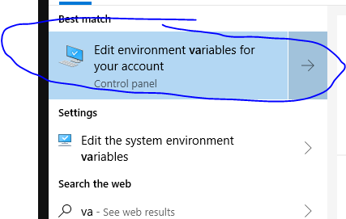
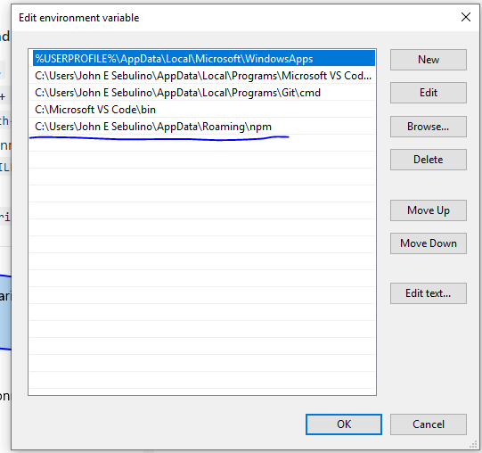

# Introduction to Modern Web Technologies Tool Chains..


#### Recommended TODOs / Command Helpers for the Session / tweaks for pc
* git add --all && git commit -m "Update readme" && git push
* clear command line using ``` cls ```
* ``` CTRL + C ``` for exiting command line programs
* Create directory ``` md ```
* Delete directory ``` rd ```
* Change directory ``` cd ```
* Create file using touch ``` touch filename.ext ```
* if you are using vsc use ``` CTRL + backticks or tilde(`) ``` to open terminal (add shift if you have CMDER)
* install touch-cli ``` npm i -g touch-cli ```
* add npm folder in your environment path 
    1. Run or Go to : ``` %USERPROFILE%\AppData\Roaming\npm ```.
    2. Copy the Path
    3. Click winkey and type `variables`

    4. Add the copied path earlier to the PATH environment variable: 

    5. Add VSC code (wcs) path to the path as well so you can run ``` code . ``` to open VSC.
* install http-server version 0.9.0 ``` npm install http-server@0.9.0 -g```

# Markdown 

# Node.JS

## What is [node.js](https://nodejs.org/en/) ?

#### NodeJS in a nutshell: 
* created by Ryan Dah by taking chromes v8 engine (fastest engine available) and embedded it inside a C++.
* Trivia: Microsoft Edge uses Chakra, Firefox uses spidermonkey, and chrome uses V8.
* is a framework for writing server-side JavaScript applications. It is built on top of the V8 JavaScript runtime and uses an event-driven, non-blocking I/O model that makes it perfect for data-intensive, real-time applications.
* uses an event-driven, non-blocking I/O model that makes it lightweight and efficient.
* Browsers provide different objects for us to carry out certain task using JavaScript. With Node, we have objects that allow us to manipulate the file system by creating and deleting folders, query databases directly, and create web servers to serve data. Both Chrome and Node contain the V8 engine, but provide different run time environments that give us access to different objects/tools to leverage different functions.
* Documentation : [NodeJS Docs](https://nodejs.org/en/docs/)

#### Benefits (from https://www.mindinventory.com/blog/pros-and-cons-of-node-js-web-app-development/)
* Node.js offers an Easy Scalability
* Easy to Learn
* Node.js is used as a Single Programming Language
* The Benefit of Fullstack JS
* Known for Offering High Performance
* The Support of Large and Active Community
* The Advantage of Caching
* Offers the Freedom to Develop Apps
* Getting Support for Commonly Used Tools
* Handles the Requests Simultaneously
* Node.js is Highly Extensible

#### NPM  - Node Package Manager
* largest package manager available
* manages automated dependency and package management
* uses package.json file to manage your  project dependencies
* you may specify what versions your project depends upon to prevent updates from breaking your project
* you can create your own package and share it to the world for them to use it.

#### NPM command lines
```
npm -v // show npm version
npm install npm -g // updates NPM to the latest version
npm help // access npm help
npm install // npm will download dependencies and devDependencies that are listed in package.json
npm install --dev // will install all dev-dependencies
npm install <package name> // install package locally
npm install <package name>@<version range> // install package locally with specified version and add the package to project dependencies
npm install <package name> --save-dev // install package locally and add the package to project dev-dependencies
npm install <package name> -g // install package globally
npm uninstall <package name>// uninstall package globally

```

### NPM vs NPX 
- NPM -> Manages packages but doesn't make life easy executing any.
- NPX -> A tool for executing Node packages.

#### Node and NPM samples

checking versions
```node
    node -v or node --version
```

Trying Node.JS in your command line
``` 
    node

    or 

    node myjsfile
```
Getting Started with NPM: 
1. Create your directory and change directory into it ``` md myproject && cd myproject ```
2. Tells npm to manage the folder / project directory by running: ``` npm init ```
3. Verify if package.json was created in your project directory 
4. Tip: you may also run ``` npm init --y ``` to questions and npm will have the default values
5. Install a package
6. Create src folder ``` md src ```
7. Create index.html and index.js
    ``` touch index.html && touch index.js ```
8. Use the package installed in node in your js file.
9. Create your html5 defaults in index.html
10. Link your JS file in your html file
11. Run with http-server ( localhost ) via command : ``` http-server ``` and access it via [http://localhost:8080/](http://localhost:8080/)

# Babel
- a JS transpiler that converts new JS code into old ones.
- is a very flexible tool in terms of transpiling. One can easily add presets such as es2015, es2016, es2017, so that Babel compiles them to ES5.
- https://babeljs.io/docs/en/

# JS Linter
- are tools that you can use to help you debug your code.
- scan your scripts for common issues and errors, and give you back a report with line numbers that you can use to fix things.
- can also check for subjective, stylistic preferences as well. Did you include a space between the function name and parentheses? Did you use single or double quotes around strings? Things like that.

## 3 Popular js linters are : 
- JSLint: Highly opinionated and based on Douglas Crockford’s Javascript: The Good Parts, it does not allow for much configuration.
- JSHint: Comes loaded with sensible defaults, but allows for a lot more configuration than JSLint.
- ESLint: An extremely configurable linter that also supports JSX and can autoformat scripts to match your preferred code formatting style.

## ESLINT
```
npm install eslint -g
./node_modules/.bin/eslint --init
```

# GIT
- is a free and open source distributed version control system designed to handle everything from small to very large projects with speed and efficiency
 
 -- SVN (Subversion), Mercurial
# GitLab


# WebPack
https://webpack.js.org/
- is a JavaScript module bundler that takes your JavaScript files and their dependencies and generates one or more JavaScript files, so you can load different pieces of code for different scenarios.

# ES6 and beyond
- ES6 refers to version 6 of the ECMA Script programming language. ECMA Script is the standardized name for JavaScript, and version 6 is the next version after version 5, which was released in 2011. It is a major enhancement to the JavaScript language, and adds many more features intended to make large-scale software development easier.
- https://www.w3schools.com/js/js_versions.asp

# TOPICS 

- Git, Gitlab & Markdowns
- EsLint
- Babel & webpack
- EcmaScript 6 and beyond
- TypeScript part 2 ( break into parts if needed)
- Visual Studio Code and beyond
- JavaScript - more
  > 
    - javascript higher order functions
    - RegEx
    - etc.
- Add more .....


# Quick Algo Game

 - Winner will choose a name to add to the KART Wheel
 - No plagiarism or copying of code from google.
n